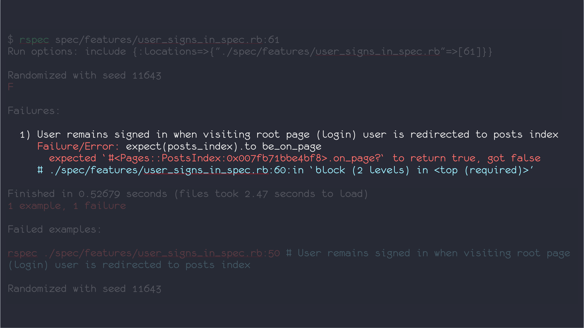
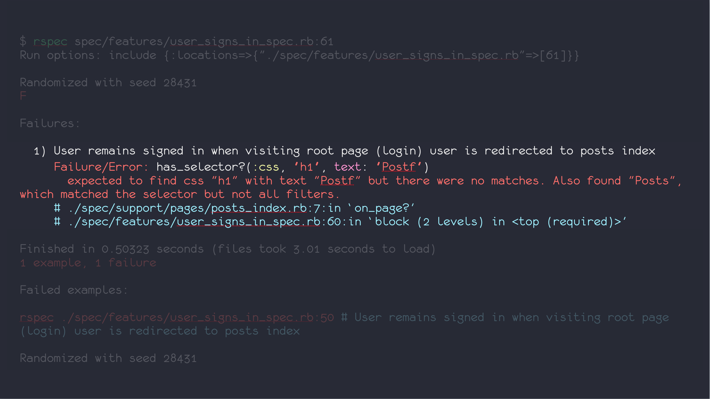

[](https://travis-ci.org/dkarter/capybara_error_intel)

Capybara provides excellent error messages for its built in predicate methods: `has_selector?`, `has_text?`, `has_title?` etc., but when those are used from Page Objects while exposing predicate methods from the PageObjects themselves the error messages are lost and all we get is `expected true, got false`.  Including this module into your PageObject by adding `include CapybaraErrorIntel::DSL` after `include Capybara::DSL` will return the heuristic error messages.

## Example

Turn this:


Into this:


## Installation

Add this line to your application's Gemfile:

```ruby
group :test do
  gem 'capybara_error_intel'
end
```

And then execute:

    $ bundle

Or install it yourself as:

    $ gem install capybara_error_intel

## Usage

Simply include at the top of your PageObject, **after** `include Capybara::DSL`.
Then use the built in Capybara::DSL as you are used to.

```ruby
module Pages
  class PostIndex
    include Capybara::DSL
    include CapybaraErrorIntel::DSL

    def on_page?
      has_selector?('h1', text: 'Posts')
    end
  end
end
```

Now this page object can be used in an expressive assertion like so:

```ruby
feature "User signs in" do
  scenario "redirected to posts index after sign in" do
    #... do the sign in dance
    post_index = Pages::PostIndex.new
    expect(post_index).to be_on_page
  end
end
```

  Note: currently this gem only supports the following Capybara built-in predicate
  methods:

  - `has_selector?(*args)`
  - `has_text?(*args)` (and `has_content?` alias)
  - `has_title?(title, options={})`
  - `has_css?(css, options={})`
  - `has_button?(locator, options={})`
  - `has_field?(locator, options={})`
  - `has_xpath?(xpath, options={})`
  - `has_checked_field?(locator, options={})`
  - `has_unchecked_field?(locator, options={})`
  - `has_select?(locator, options={})`
  - `has_table?(locator, options={})`


  It should be rather trivial to add more of them. Please open an issue or submit a pull request if something you need is missing.


## Development

After checking out the repo, run `bin/setup` to install dependencies. Then, run `rake spec` to run the tests. You can also run `bin/console` for an interactive prompt that will allow you to experiment.

To install this gem onto your local machine, run `bundle exec rake install`. To release a new version, update the version number in `version.rb`, and then run `bundle exec rake release`, which will create a git tag for the version, push git commits and tags, and push the `.gem` file to [rubygems.org](https://rubygems.org).

## Contributing

Bug reports and pull requests are welcome on GitHub at
https://github.com/dkarter/capybara_error_intel

Please make sure the test suite passes and that you added tests for any new
method implemented.


## License

The gem is available as open source under the terms of the [MIT License](http://opensource.org/licenses/MIT).

